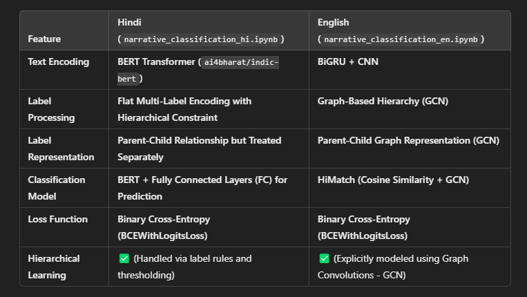

# LAB REPORT: HIERARCHICAL MULTI-LABEL NARRATIVE CLASSIFICATION ON ONLINE NEWS

## 1. Introduction
- **Project Focus:** Multilingual narrative classification in English and Hindi.
- **Purpose:** Build robust models for hierarchical, multi-label, multi-class narrative classification.
- **Objectives:** 
  - Improve narrative detection accuracy.
  - Compare performance between languages.
  - Evaluate model effectiveness.
- **Research Question:** 
  - *Can hierarchical models like BiGRU+CNN and HiMatch effectively classify narratives in multilingual datasets?*

## 2. Related Work
- **Literature Review:** 
  - Studies on narrative classification, hierarchical models, and multilingual NLP.
- **Key Methodologies:** 
  - Graph Convolutional Networks (GCN), BiGRU, CNN, and BERT in text classification.
- **Previous Projects:** 
  - Outcomes of similar projects using hierarchical classification techniques.

## 3. Data Exploration and Preprocessing
- **Data Sources:** 
  - English and Hindi narrative datasets, origins, and formats.
- **Dataset Details:** 
  - Size, number of labels, hierarchical structure.
- **Text Data Analysis:** 
  - Average document length, word count, frequent words.
- **Data Visualization:** 
  - Label distributions, word frequency histograms, document length histograms.
- **Preprocessing Steps:** 
  - Tokenization, cleaning (removing symbols, extra spaces).
  - Encoding:
    - **IndicBERT Transformer** (`ai4bharat/indic-bert`) for Hindi.
    - **Custom Vocabulary** with BiGRU+CNN for English.

## 4. Methodology
- **English Model (BiGRU+CNN with GCN):** 
  - Text feature extraction using BiGRU and CNN layers.
  - Graph-based hierarchy modeled using **Graph Convolutional Networks (GCN)**.
- **Hindi Model (BERT + FC):** 
  - **Flat multi-label encoding** with hierarchical constraints.
  - Narrative classification using **IndicBERT** and fully connected layers for prediction.
- **Label Representation:** 
  - **English:** Parent-child relationships modeled via **GCN**.
  - **Hindi:** Parent-child relationships treated separately with hierarchical thresholding.
- **Libraries/Frameworks:** 
  - PyTorch, Transformers, NetworkX for graph processing.

## 5. Experimental Setup
- **Training Process:** 
  - Hyperparameters: Learning rate, batch size, epochs.
  - Optimization techniques: **Adam optimizer**.
- **Fine-Tuning:** 
  - Adjustments made on pre-trained IndicBERT for Hindi.
- **Data Splitting:** 
  - 90-10 train-validation split, stratified where applicable.

## 6. Evaluation and Results
- **Evaluation Metrics:** 
  - Precision, Recall, F1-score for multi-label classification.
- **Results Presentation:** 
  - Quantitative metrics, confusion matrices.
  - Comparison between English (GCN-based) and Hindi (BERT-based) models.
- **Visualizations:** 
  - training-validation loss plots.
- **Benchmark Comparison:** 
  - Compare with existing benchmarks if available.

## 7. Analysis and Discussion
- **Results Interpretation:** 
  - Analyze model performance differences between languages.
- **Strengths:** 
  - GCN’s effective modeling of hierarchies in English.
  - IndicBERT's efficiency in handling Hindi text with hierarchical constraints.
- **Weaknesses:** 
  - Overfitting in smaller datasets, limited generalization.
- **Unexpected Findings:** 
  - Bias in label distribution, challenges with rare classes.
- **Limitations:** 
  - Dataset size, computational constraints.
- **Practical Applications:** 
  - Automated media analysis, misinformation detection.

## 8. Conclusion
- **Key Findings:** 
  - Effectiveness of **BiGRU+CNN with GCN** for English.
  - Success of **IndicBERT with hierarchical rules** for Hindi.
- **Research Question Revisited:** 
  - Confirm hierarchical models' efficacy in multilingual narrative classification.
- **Project Achievements:** 
  - Highlight key contributions and implications.

## 9. Future Work
- **Improvements:** 
  - Larger datasets, multilingual model integration, advanced preprocessing techniques.
- **Unresolved Issues:** 
  - Handling imbalanced data, refining model architectures.
- **Extensions:** 
  - Real-time narrative classification, adaptation to other languages.

## 10. References
- **Citations:** 
  - All datasets, research papers, tools, and libraries used.
- **Key Literature:** 
  - Hierarchical classification, BiGRU, CNN, GCN, BERT, and multilingual NLP.

# Narrative Classification Methodology

The methodology used for performing narrative classification for both Hindi and English is summarized below:

[View Project Report (PDF)](Poster_Presentation_Finalized.pdf)

For a detailed explanation of the architecture used, please refer to the research papers:  

- [📄 Hierarchy-aware Label Semantics Matching Network for Hierarchical Text Classification](https://aclanthology.org/2021.acl-long.337/)  
- [📄 HGBL: A Fine Granular Hierarchical Multi-Label Text Classification Model](https://link.springer.com/article/10.1007/s11063-024-11713-x/)

